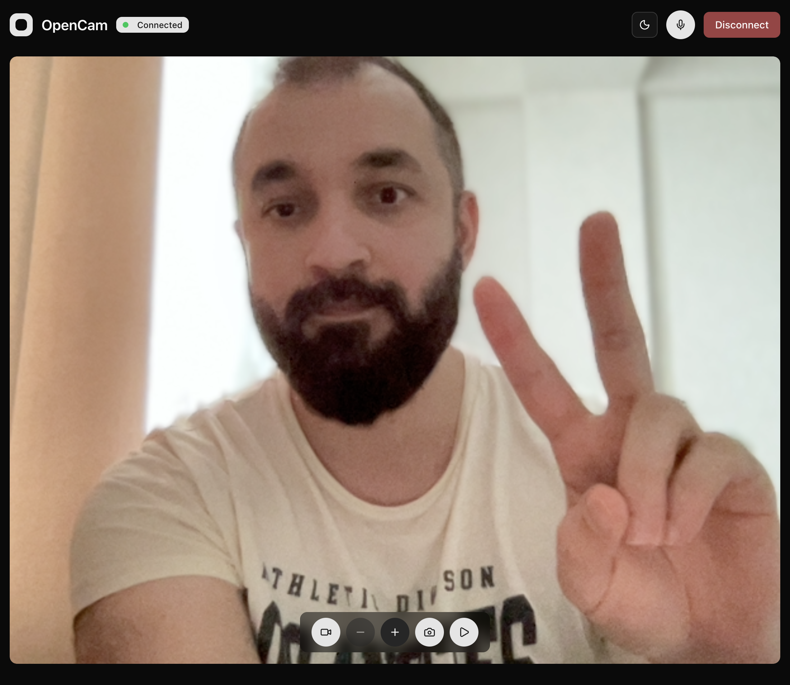

<a href="https://opencam-oss.vercel.app">
  
  <h1 align="center">OpenCam</h1>  
</a>

<p align="center">
  Realtime AI Camera Built with Next.js and OpenAI.
</p>

<p align="center">
  <a href="#features"><strong>Features</strong></a> ·
  <a href="#model-provider"><strong>Model provider</strong></a> ·
  <a href="#deploy-your-own"><strong>Deploy Your Own</strong></a> ·
  <a href="#running-locally"><strong>Running locally</strong></a>
</p>
<br/>

## Features

- [Next.js](https://nextjs.org/)
  - App Router with file-based routing, type-safe from server to client
  - Built on Turbopack for a lightning-fast HMR development experience
- [OpenAI Agent SDK](https://openai.github.io/openai-agents-js/guides/voice-agents/)
  - Realtime voice agents with seamless audio streaming
  - Real-time image streaming and analysis capabilities
- [Camera Integration](https://developer.mozilla.org/en-US/docs/Web/API/MediaDevices/getUserMedia)
  - Real-time webcam access with live video streaming
  - Image capture and frame-by-frame analysis
- [Shadcn/ui](https://ui.shadcn.com)
  - Styling with [Tailwind CSS](https://tailwindcss.com)
  - Component primitives from [Radix UI](https://radix-ui.com) for accessibility and flexibility

## Model provider

This app utilizes the [OpenAI API](https://openai.com/) for its AI capabilities. It is configured to use the following OpenAI models:

- Realtime Model (`gpt-realtime`): Higher quality conversational model with higher latency

The app leverages these models through the [OpenAI Agent SDK](https://openai.github.io/openai-agents-js/guides/voice-agents/) to create a sophisticated voice-driven camera experience with real-time audio processing and intelligent agent handoffs.

## Deploy your own

You can deploy your own version of OpenCam to Vercel with one click:

[](https://vercel.com/new/clone?repository-url=https%3A%2F%2Fgithub.com%2Fmurabcd%2Fopencam&env=OPENAI_API_KEY&envDescription=You%27ll%20need%20an%20OpenAI%20API%20key.&envLink=https%3A%2F%2Fgithub.com%2Fmurabcd%2Fopencam%2Fblob%2Fmain%2F.env.example&demo-title=OpenCam&demo-description=An%20Open-source%20AI%20Camera%20App%20Built%20With%20Next.js%20and%20OpenAI.&demo-url=https%3A%2F%2Fopencam-oss.vercel.app)

## Running locally

You will need to use the environment variables [defined in `.env.example`](.env.example) to run OpenCam. It's recommended you use [Vercel Environment Variables](https://vercel.com/docs/projects/environment-variables) for this, but a `.env` file is all that is necessary.

> Note: You should not commit your `.env` file or it will expose secrets that will allow others to control access to your OpenAI account.

1. Install Vercel CLI: `bun i -g vercel`
2. Link local instance with Vercel and GitHub accounts (creates `.vercel` directory): `vercel link`
3. Download your environment variables: `vercel env pull`

```bash
bun install
bun dev
```

Your app should now be running on [localhost:3000](http://localhost:3000/).
